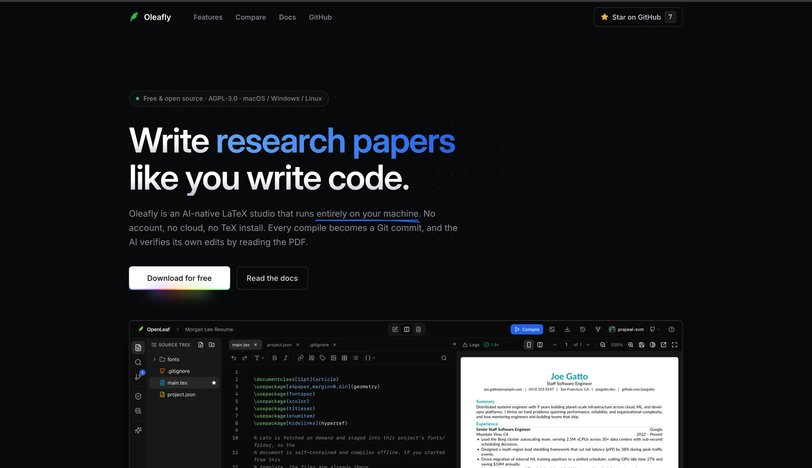

<div align="center">

# oleafly.com

### The web home of [Oleafly](https://github.com/Oleafly/Oleafly), the free, open-source, local-first LaTeX studio.

[](https://github.com/Oleafly/oleafly-web/actions/workflows/deploy.yml)
[](LICENSE)
[](https://oleafly.com)
[](https://oleafly.com)
[](https://github.com/Oleafly/oleafly-web)

<a href="https://oleafly.com"></a>

**[oleafly.com](https://oleafly.com) · [Docs](https://oleafly.com/docs/overview/) · [Download the app](https://github.com/Oleafly/Oleafly/releases/latest)**

</div>

<br/>

This repo is the website: the page you see at [oleafly.com](https://oleafly.com) and the product docs at [oleafly.com/docs](https://oleafly.com/docs/overview/). If you're looking for the app itself, that lives at [Oleafly/Oleafly](https://github.com/Oleafly/Oleafly).

Built with [Astro](https://astro.build) and [Starlight](https://starlight.astro.build). Everything is static. No server, no database, no third-party requests, and the only JavaScript that ships is for the animations.

## Run it locally

You need Node 22+ and pnpm.

```bash
git clone https://github.com/Oleafly/oleafly-web.git
cd oleafly-web
pnpm install
pnpm dev
```

Open http://localhost:4321 and you're looking at the site. Edits reload live.

## Where things live

The main page is one file: `src/pages/index.astro`. Markup, styles, and scripts are all in there, so if you want to change a section or its copy, that's the place.

The docs are markdown files in `src/content/docs/docs/`. One file per page. Fix a typo, save, done. If you add a new page, also add it to the sidebar in `astro.config.mjs` so people can find it.

A few other places you might touch:

- `src/components/` holds the interactive pieces (the bento grid, the file tree, the confetti). Most are React with small CSS animations defined in `src/styles/magicui.css`.
- `public/media/` has the screenshots and demo videos shared with the app's README.
- `src/styles/theme.css` is the docs theme. The main page doesn't use it.

## Contributing

Typo fixes and small improvements: open a pull request directly, no need to ask first.

Bigger changes (new sections, layout changes, new pages): open an issue first so we can talk it through. The page is deliberately tight and we say no to most additions, not because they're bad ideas but because a short page that loads fast is one of our primary goals.

Run `pnpm build` before you push. If the build passes locally it will pass in CI.

## How deploys work

Every push to `main` deploys automatically. A GitHub Action builds the site and uploads it to Cloudflare Pages, usually live within a minute. Pull requests don't deploy, so you can't break production with one.

`www.oleafly.com` and `docs.oleafly.com` both redirect to the main domain (`docs.oleafly.com/faq` lands on `oleafly.com/docs/faq`).

One thing to know if you add images or video: Cloudflare rejects files over 25MB. Use MP4 for screen recordings, not GIF. An `ffmpeg` one-liner gets a 45MB GIF down to 2MB.

## License

MIT. The Oleafly app itself is AGPL-3.0, but this website's code is free to reuse however you like.
