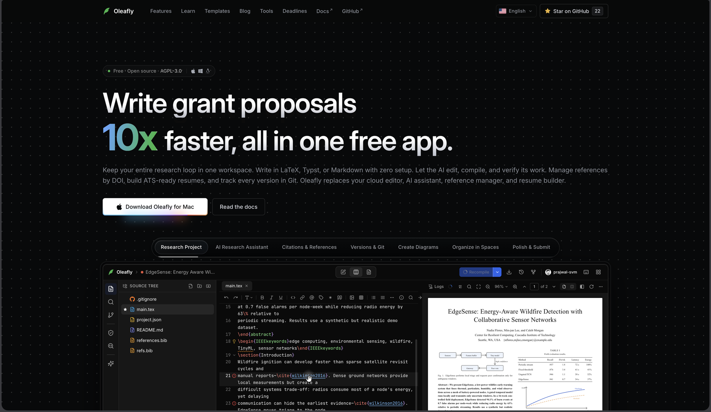

<div align="center">

# oleafly.com

### The website and documentation for [Oleafly](https://github.com/Oleafly/Oleafly), a free and open-source local-first writing studio.

[](https://github.com/Oleafly/oleafly-web/actions/workflows/deploy.yml)
[](LICENSE)
[](https://oleafly.com)
[](https://oleafly.com)
[](https://github.com/Oleafly/oleafly-web)

<a href="https://oleafly.com"></a>

**[oleafly.com](https://oleafly.com) · [Docs](https://oleafly.com/docs/overview/) · [Download the app](https://github.com/Oleafly/Oleafly/releases/latest)**

</div>

<br/>

This repository contains [oleafly.com](https://oleafly.com) and its [product documentation](https://oleafly.com/docs/overview/). The desktop app lives in [Oleafly/Oleafly](https://github.com/Oleafly/Oleafly).

The site uses [Astro](https://astro.build) and [Starlight](https://starlight.astro.build) and deploys as static files. It has no application server or database. Client JavaScript supports interactive pages, navigation, localization, and privacy-aware analytics. The production build also fetches release and project data used to generate static pages.

## Run it locally

You need Node 22+ and pnpm.

```bash
git clone https://github.com/Oleafly/oleafly-web.git
cd oleafly-web
pnpm install
pnpm dev
```

Open <http://localhost:4321>. Edits reload as you work.

## Supported languages

The site ships **18 locales**. English is the default at the site root (no URL prefix). Every other language is a first-class path under `/{locale}/…` (for example `https://oleafly.com/zh-cn/learn/`). The header language switcher shows a **flag + native name** for each option.

| Flag | Locale | Native name | English name | URL | BCP-47 |
|:----:|:------:|-------------|--------------|-----|--------|
|  | `en` | English | English | `/` (default) | `en` |
|  | `zh-cn` | 简体中文 | Chinese (Simplified) | `/zh-cn/` | `zh-CN` |
|  | `zh-tw` | 繁體中文 | Chinese (Traditional) | `/zh-tw/` | `zh-TW` |
|  | `ja` | 日本語 | Japanese | `/ja/` | `ja` |
|  | `ko` | 한국어 | Korean | `/ko/` | `ko` |
|  | `es` | Español | Spanish | `/es/` | `es` |
|  | `pt-br` | Português | Portuguese (Brazil) | `/pt-br/` | `pt-BR` |
|  | `fr` | Français | French | `/fr/` | `fr` |
|  | `de` | Deutsch | German | `/de/` | `de` |
|  | `hi` | हिन्दी | Hindi | `/hi/` | `hi` |
|  | `it` | Italiano | Italian | `/it/` | `it` |
|  | `nl` | Nederlands | Dutch | `/nl/` | `nl` |
|  | `pl` | Polski | Polish | `/pl/` | `pl` |
|  | `ru` | Русский | Russian | `/ru/` | `ru` |
|  | `uk` | Українська | Ukrainian | `/uk/` | `uk` |
|  | `tr` | Türkçe | Turkish | `/tr/` | `tr` |
|  | `ar` | العربية | Arabic (RTL) | `/ar/` | `ar` |
|  | `vi` | Tiếng Việt | Vietnamese | `/vi/` | `vi` |

Examples:

- Japanese learn index → https://oleafly.com/ja/learn/
- Simplified Chinese home → https://oleafly.com/zh-cn/
- Spanish templates → https://oleafly.com/es/templates/
- Hindi tools → https://oleafly.com/hi/tools/

Language is **not** forced by country or IP address. The URL always wins. The switcher can save a preference, and the home page may suggest a browser-language match on a first visit. Shared deep links are never rewritten.

## Contributing

For typo fixes and small improvements, open a pull request directly.

For new sections, layout changes, or new pages, open an issue first. Keeping the site focused and fast is a product requirement.

Run `pnpm test` and `pnpm build` before you push.

## How deploys work

Every push to `main` deploys automatically. A GitHub Action builds the site and uploads it to Cloudflare Pages, usually live within a minute. Pull requests don't deploy, so you can't break production with one.

`www.oleafly.com` and `docs.oleafly.com` both redirect to the main domain (`docs.oleafly.com/faq` lands on `oleafly.com/docs/faq`).

## License

MIT. The Oleafly app itself is AGPL-3.0, but this website's code is free to reuse however you like.
